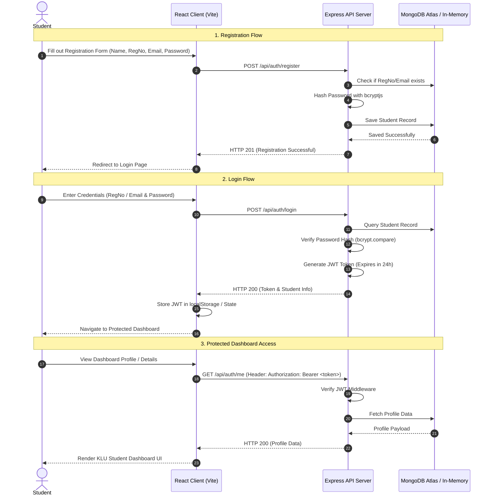

# 🔄 Development & Operational Workflow

This document outlines the standard development cycle, git branching conventions, data flow, authentication sequence, and CI/CD pipelines for the **KLU Student Authentication System**.

---

## 📋 1. End-to-End Authentication Workflow



---

## 💻 2. Local Development Workflow

### Step 1: Initial Repository Bootstrapping
```bash
# Clone the repository
git clone https://github.com/yaswanthreddy2006/project.git
cd project4

# Install all dependencies (Server & Client)
npm run install:all
```

### Step 2: Environment Configuration
Ensure `.env` exists in the root folder:
```env
PORT=5000
MONGO_URI=mongodb+srv://<user>:<password>@cluster.mongodb.net/klu_auth
JWT_SECRET=klu_secret_key_2026
NODE_ENV=development
```

### Step 3: Running Development Servers
Run the client build and server concurrently:
```bash
# Production preview mode (build client + start server)
npm run dev

# Or run server and client individually during active UI development:
# Terminal 1 (Backend)
cd server && npm run dev

# Terminal 2 (Frontend)
cd client && npm run dev
```

---

## 🌿 3. Git Branching & Version Control Workflow

### Branch Naming Conventions
- `main` - Stable, production-ready code.
- `feature/<short-description>` - For new features (e.g., `feature/password-reset`).
- `fix/<short-description>` - For bug fixes (e.g., `fix/jwt-expiration-bug`).
- `docs/<short-description>` - For documentation updates.

### Commit Message Guidelines (Conventional Commits)
Use clear prefixes when committing code:
- `feat:` New feature added
- `fix:` Bug fix implemented
- `docs:` Documentation updated
- `style:` Formatting, UI tweaks (no code logic changes)
- `refactor:` Code restructuring without behavior changes
- `test:` Unit or integration tests added
- `chore:` Dependency or build setup updates

**Example:**
```bash
git checkout -b feature/student-profile-tab
git add .
git commit -m "feat: add academic summary card to student dashboard"
git push origin feature/student-profile-tab
```

---

## ⚡ 4. Continuous Integration & Deployment (CI/CD)

Automated checks run via GitHub Actions on every push to `main` or Pull Request:

1. **Lint & Build Verification**: Verifies frontend React components compile cleanly (`npm run build`).
2. **Server Dependency Check**: Validates Express routes and database connections.
3. **Production Asset Bundling**: Compiles client assets into `client/dist/` served statically by Node.js in production.

---

## 🛠️ Troubleshooting & Health Checks

- **Server Health Endpoint**: `http://localhost:5000/api/health`
- **Fallback DB Mode**: If `MONGO_URI` is not reachable, the server automatically starts an in-memory MongoDB instance (`mongodb-memory-server`) for seamless offline local development.
